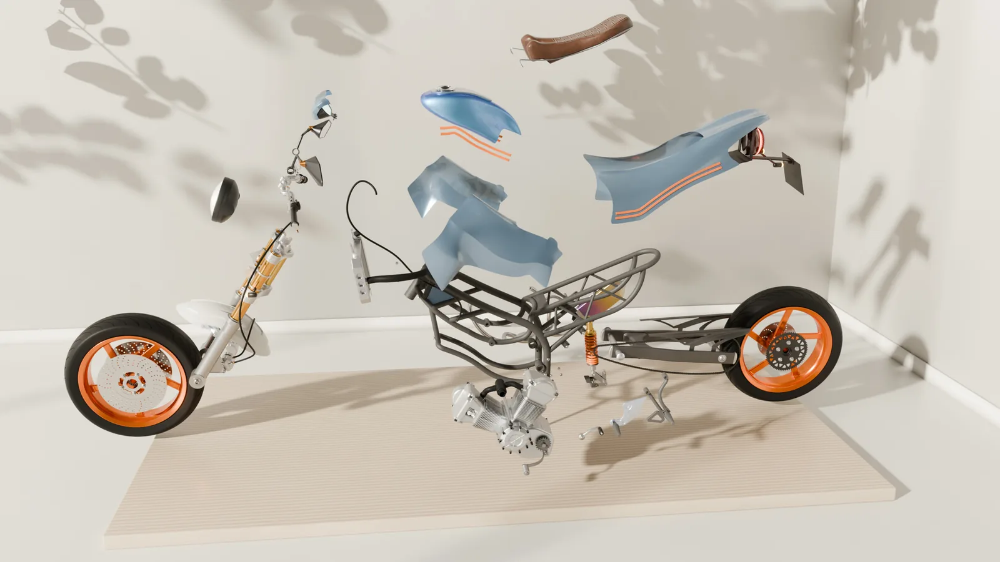

# Hi, I'm Micheal 👋

**I design machines, then check them twice:** once by hand, once in ANSYS. I'm a third-year mechanical engineering student at the University of Lagos, working towards transmission and chassis design.

Portfolio and full case studies: **[mikedoesrobots.com](https://mikedoesrobots.com)**

## Selected work

- **[Café Racer Concept](https://mikedoesrobots.com/work/cafe-racer/)**: a complete motorcycle modelled part by part (217 parts), a frame redesigned until it passed, two parts planned for manufacture, and a 70-second product film. SolidWorks → ANSYS → Blender. Files in [`motorcycle`](https://github.com/brickflows/motorcycle).
- **[Front wing in ground effect](https://mikedoesrobots.com/work/front-wing/)**: one wing at eleven ride heights in ANSYS Fluent. Downforce rises 47% as the gap closes to 44 mm, then stalls. Files in [`motorcycle/simulation/aerodynamics`](https://github.com/brickflows/motorcycle/tree/main/simulation/aerodynamics).
- **Navi smart cane**: a navigation cane built by a four-person team. I lead the electronics and embedded side. In progress.
- **6-axis cinema robot arm**: joint torques sized from first principles. In design.

## Also on this profile

- **[HealthMate](https://github.com/brickflows/CJID-HACKATHON-Healthmate-AI)**: 2nd place, CJID competition 2025.
- **[Seven Styles](https://github.com/brickflows/sevenstyles)**: an AI fashion design SaaS I worked on.

## Writing

- [A mechanic is not a mechanical engineer](https://mikedoesrobots.com/blog/mechanic-apprenticeship/): six months as a mechanic's apprentice before university, and what did and didn't carry over to the degree.

## Get in touch

I'm looking for a 2027 internship, anywhere that builds hardware.

[Email](mailto:michealadedirann@gmail.com) · [X](https://x.com/mikedoesrobots) · [YouTube](https://www.youtube.com/watch?v=PtR7k8kXTPk) · [mikedoesrobots.com](https://mikedoesrobots.com)
